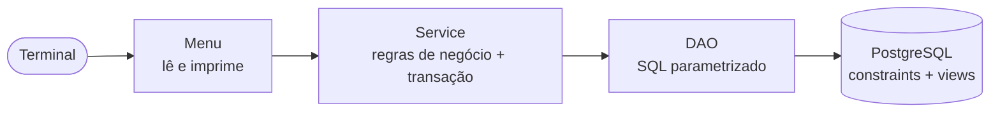
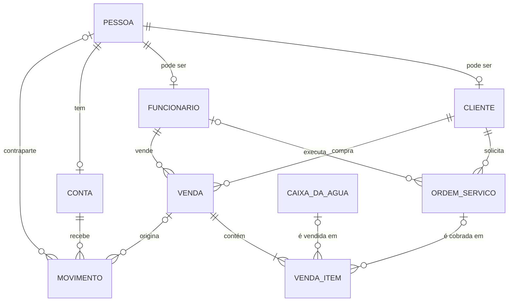

# Aqua Management

Sistema de gestão para uma loja de caixas d'água: catálogo e estoque, ordens de serviço, vendas, contas a receber e caixa da empresa. Roda no terminal, foi escrito em Kotlin sobre JDBC puro e usa um PostgreSQL com bastante regra no próprio banco.


```bash
git clone https://github.com/JoaoMartins90/cli-aqua-management.git
cd cli-aqua-management
docker compose run --rm app
```

---

## O que o sistema faz

A loja vende caixas d'água e presta serviços (instalação, limpeza, manutenção e troca). O sistema cobre o ciclo inteiro, do cadastro ao dinheiro em caixa:

- **Pessoas e papéis**: uma pessoa é identificada pelo CPF/CNPJ e pode ser cliente, funcionário ou as duas coisas, sem cadastro duplicado. O cliente tem limite de crédito; o funcionário tem setor, salário e data de admissão.
- **Catálogo de caixas d'água**: modelo, capacidade, medidas, material, cor, preço e estoque. Uma caixa que já foi vendida não é apagada: ela é desativada, sai do catálogo de venda e continua no histórico.
- **Ordens de serviço**: agenda das ordens em aberto (com aviso de atraso), responsável designado e ciclo de status validado:

  ```
  AGENDADO ──► EM_EXECUCAO ──► CONCLUIDO
      │              │
      └──► CANCELADO ◄┘
  ```

- **Vendas**: uma venda pode ter várias caixas e várias ordens de serviço concluídas. Pode ser à vista (entra no caixa na hora) ou a prazo (respeita o limite de crédito do cliente). O preço é sugerido pelo catálogo e pode ser negociado no item. Cancelar uma venda devolve o estoque e estorna o que já foi pago.
- **Financeiro**: recebimento parcial ou total de vendas a prazo, contas a receber, serviços concluídos ainda não cobrados, extrato e saldo do caixa, pagamento de salário e estorno de qualquer lançamento.
- **Conferência de integridade**: toda vez que abre, o sistema recalcula os totais das vendas e os saldos das contas a partir dos dados de origem e avisa se algo não bater.

### Mapa dos menus

```
MENU PRINCIPAL
├── 1 CADASTROS
│   ├── 1 Pessoas ............ cadastrar / adicionar papel, listar, alterar, remover
│   └── 2 Caixas d'água ...... cadastrar, alterar, listar, remover, reativar
├── 2 OPERAÇÃO
│   ├── 1 Vendas ............. nova venda, listar, detalhe, cancelar
│   └── 2 Ordens de serviço .. nova, agenda, listar, designar, reagendar, iniciar, concluir, cancelar
└── 3 FINANCEIRO ............. receber, contas a receber, serviços a faturar, extrato, salário, estorno
```

---

## Stack

| Área | Tecnologia |
|---|---|
| Linguagem | Kotlin 2.4 na JVM 21 |
| Banco de dados | PostgreSQL 18 |
| Acesso a dados | JDBC puro (driver `org.postgresql` 42.7), sem ORM |
| Build | Gradle 9 (Kotlin DSL) com wrapper e toolchain |
| Infra | Docker + Docker Compose |
| Dependências externas | só o driver JDBC. Não há framework. |

---

## Como rodar

### Com Docker (recomendado)

Só é preciso ter o Docker com o Compose v2. Não precisa de JDK, Gradle nem PostgreSQL instalados.

```bash
docker compose run --rm app
```

Esse comando:

1. gera a imagem do app, compilando o projeto com Gradle dentro do container;
2. sobe o PostgreSQL 18 e, na primeira vez, executa `db/schema.sql` e `db/seed.sql`;
3. espera o banco ficar pronto (healthcheck) e abre o sistema no seu terminal.

> **Por que `run` e não `up`?** O sistema é uma CLI interativa, e o `docker compose up` não conecta o seu teclado ao container. Por isso o serviço `app` fica num *profile*: o `up` sobe só o banco, e o `run` sobe o banco e abre o app.

Para sair, use a opção `0` no menu principal. `Ctrl+D` encerra o programa a qualquer momento.

**Comandos úteis**

| Comando | O que faz |
|---|---|
| `docker compose up -d` | Sobe só o banco, em `localhost:5433` (para rodar o app pela IDE) |
| `docker compose exec db psql -U postgres -d gerenciador` | Abre o `psql` no banco (experimente `SELECT * FROM vw_contas_receber;`) |
| `docker compose build app` | Gera a imagem de novo depois de alterar o código |
| `docker compose down` | Para o banco e mantém os dados |
| `docker compose down -v` | Apaga os dados: na próxima subida o schema e o seed rodam de novo |

### Sem Docker (IDE ou terminal)

Requisitos: JDK 21 e um PostgreSQL. Se a máquina não tiver o JDK 21, o Gradle baixa um automaticamente.

1. **Banco**: o jeito mais simples é `docker compose up -d`. Se for usar um PostgreSQL próprio, crie o banco `gerenciador` e rode:

   ```bash
   psql -U postgres -d gerenciador -f db/schema.sql
   psql -U postgres -d gerenciador -f db/seed.sql
   ```

2. **App**:

   ```bash
   ./gradlew run -q --console=plain        # Windows: gradlew.bat run -q --console=plain
   ```

   Pela IDE, abra a pasta como projeto Gradle e execute `src/Main.kt`.

A conexão é configurada por variáveis de ambiente:

| Variável | Padrão |
|---|---|
| `DB_URL` | `jdbc:postgresql://localhost:5433/gerenciador` |
| `DB_USER` | `postgres` |
| `DB_PASSWORD` | `postgres` |

### Dados de demonstração

O `db/seed.sql` deixa o sistema pronto para testar:

- a conta da loja ("Caixa da loja", CNPJ `11222333000181`);
- quatro caixas no catálogo (Tigre 310 L e 500 L, Fortlev 1000 L e 2000 L);
- **Maria Vendedora**, funcionária do setor de vendas (CPF `11122233344`);
- **Joao Cliente**, cliente com R$ 1.000,00 de limite de crédito (CPF `55566677788`).

### Roteiro para testar em 5 minutos

O roteiro passa pelas principais regras do sistema:

1. **OPERAÇÃO → ORDENS DE SERVIÇO → Nova ordem**: informe o CPF `55566677788`, escolha *Instalação*, preço `150` e uma data/hora **que já passou** (por exemplo, hoje às 08:00). Designe a Maria como responsável.
2. **Iniciar ordem**, depois **Concluir ordem** (Enter = agora). A ordem aparece em **FINANCEIRO → Serviços a faturar**.
3. **OPERAÇÃO → VENDAS → Nova venda** para o mesmo CPF: adicione 2 caixas Tigre Basic 500 e a ordem concluída. Escolha **a prazo**. O total é R$ 709,80, dentro do limite de R$ 1.000,00.
4. **FINANCEIRO → Contas a receber** mostra a venda em aberto. Em **Receber pagamento**, receba R$ 300 via Pix: a venda continua devendo R$ 409,80.
5. **OPERAÇÃO → VENDAS → Cancelar venda**: as caixas voltam ao estoque, os R$ 300 são estornados (veja o **Extrato**) e a ordem de serviço volta para *Serviços a faturar*.
6. Saia e entre de novo: a conferência de abertura continua dizendo que está tudo certo.

---

## Arquitetura

### Camadas



### Estrutura de pastas

```
src/
├── Main.kt            # monta as dependências (classe App) e os menus de topo
├── db/                # conexão, transação e helpers de ResultSet
├── utils/             # leitura validada do terminal (texto, número, data, s/n, listas)
├── enums/             # domínios fechados: status, cor, material, forma de pagamento...
├── pessoa/            # pessoa e papéis; coordena cliente, funcionário e conta
├── cliente/
├── funcionario/
├── caixadaagua/       # catálogo e estoque
├── servico/           # ordem de serviço e o ciclo de status
├── venda/             # pedido, venda e itens
├── movimentacao/      # lançamentos financeiros e estornos
├── financeiro/        # contas, recebimento, salário, contas a receber
└── conferencia/       # auditoria de integridade na abertura
db/
├── schema.sql         # tabelas, constraints, índices e views, tudo comentado
└── seed.sql           # conta da loja, catálogo e dados de demonstração
```

Cada funcionalidade segue o mesmo formato: `Entidade.kt` (data class), `EntidadeDAO.kt`, `EntidadeService.kt` e `EntidadeMenu.kt`.

### Modelo de dados



O [`db/schema.sql`](db/schema.sql) explica cada tabela, coluna e regra nos comentários.

---

## Decisões de arquitetura

### No código

**Package-by-feature.** As pastas são assuntos do negócio (`venda/`, `servico/`, `financeiro/`), não camadas técnicas. Quem precisa mexer em vendas encontra modelo, SQL, regras e tela juntos, e os imports mostram quais funcionalidades dependem de quais.

**Três camadas com papéis fixos.** O *Menu* só conversa com o terminal, o *Service* concentra as regras e as transações, e o *DAO* só executa SQL. O menu coleta **toda** a entrada antes de chamar o service. Assim, nenhuma transação fica aberta esperando o usuário digitar, e os services poderiam atender outra interface (uma API REST, por exemplo) sem mudanças. A interface em terminal é simples de propósito: o foco do projeto está no domínio e nos dados.

**JDBC puro, sem ORM nem framework.** O objetivo era praticar modelagem relacional, SQL e controle transacional, justamente o que um ORM esconderia. Todas as consultas usam `PreparedStatement`, então não existe SQL montado por concatenação. A desvantagem é ter mais código repetitivo nos DAOs.

**Injeção de dependência manual.** A classe `App` em [`Main.kt`](src/Main.kt) monta todos os objetos uma vez e passa DAOs e services pelo construtor. Com cerca de 20 classes, isso deixa cada dependência explícita sem precisar de um container de DI.

**Transações reentrantes.** Uma venda grava cabeçalho, itens, baixa de estoque, lançamento financeiro e saldo, e as cinco coisas acontecem juntas ou nenhuma acontece. [`Connection.emTransacao { }`](src/db/Transacao.kt) faz commit ou rollback e, se já houver uma transação aberta, só participa dela. Por isso `MovimentoService.registrar` é atômico tanto sozinho quanto dentro de `VendaService.vender`. A baixa de estoque também é atômica: `UPDATE ... SET estoque_atual = estoque_atual - ? WHERE id = ? AND estoque_atual >= ?` faz o banco conferir e descontar o estoque num único comando.

**Dinheiro em `BigDecimal` / `NUMERIC`, nunca `Double`.** Os valores são validados para ter no máximo duas casas decimais, tanto na leitura do terminal quanto nos services.

### Na modelagem dos dados

**Pessoa + papéis.** Cliente e funcionário são papéis de uma `pessoa` (CPF/CNPJ único), então a mesma pessoa pode ser as duas coisas sem cadastro duplicado. A própria empresa é uma pessoa jurídica com uma conta. Por isso pagar salário e receber de cliente usam o mesmo mecanismo de lançamento.

**Lançamentos financeiros imutáveis.** Um movimento nunca é editado nem apagado. Para corrigir um erro, grava-se um **estorno**: um movimento de tipo contrário que aponta para o original por `estorno_de_id`. Um `UNIQUE` nessa coluna garante que cada movimento seja estornado no máximo uma vez. Assim o histórico fica auditável e o saldo nunca fica ambíguo.

**Estado calculado em vez de status guardado.** "Venda paga" e "ordem de serviço faturada" **não** são status: o banco responde essas perguntas com views (`vw_contas_receber`, `vw_ordem_servico_a_faturar`). Se fossem status, haveria duas versões da verdade que podem divergir. Por exemplo, uma venda cancelada deixaria a ordem presa em "faturada" para sempre. Do jeito atual, cancelar a venda devolve a ordem à fila de cobrança sem nenhum código extra.

**Preço e descrição congelados no item da venda.** O catálogo guarda o preço de *hoje*, e o item guarda o preço *negociado* no dia da venda, o que também permite dar desconto. Se a caixa ficar mais cara ou sair do catálogo, as vendas antigas continuam valendo o que o cliente pagou.

**Desativar em vez de apagar quando há histórico.** Caixa já vendida é desativada, e funcionário demitido ganha uma `data_demissao`. Os dois continuam existindo porque vendas e ordens antigas apontam para eles.

**Enums do Kotlin como única fonte de verdade.** Status, cores, formas de pagamento etc. são `enum class`. O banco guarda o `name()` em `VARCHAR`, sem um `CHECK` que repita a lista. Na leitura, [`ResultSet.enumDe<T>()`](src/db/ResultSets.kt) gera um erro com mensagem clara se aparecer um valor desconhecido. *Desvantagem consciente:* o banco não barra um valor inválido inserido fora do sistema, então essa validação fica nos services.

**Integridade também no banco.** O PostgreSQL garante a estrutura, além do código: chaves estrangeiras, `UNIQUE` e `CHECK` (preço > 0, estoque ≥ 0, CPF com 11 dígitos ou CNPJ com 14). O `subtotal` do item é uma coluna gerada, e `num_nonnulls(caixa_da_agua_id, ordem_servico_id) = 1` garante que o item é *ou* uma caixa *ou* um serviço. Todas as chaves estrangeiras têm índice, e a agenda de ordens em aberto usa um índice parcial.

**Totais guardados e conferidos.** `conta.saldo` e `venda.valor_total` ficam gravados para a leitura ser rápida e são atualizados na mesma transação que os origina. Duas views de auditoria (`vw_conferencia_saldo` e `vw_conferencia_venda`) recalculam esses valores a partir dos movimentos e dos itens e devem voltar sempre vazias. O sistema roda as duas na abertura e avisa se algo não bater.

### Na infraestrutura

**Docker Compose pensado para uma CLI.** O app fica num *profile* e é aberto com `run`, que conecta o terminal ao container. O healthcheck do banco testa a conexão por TCP: durante os scripts de inicialização, o PostgreSQL só aceita conexões pelo socket local, e um teste pelo socket daria "pronto" antes da hora. O banco usa a porta 5433 no host para não conflitar com um PostgreSQL local.

**Gradle com wrapper e toolchain.** Quem clona o repositório não precisa ter o Gradle instalado nem acertar a versão do JDK: o wrapper e a toolchain cuidam disso. A imagem final tem só o JRE e o app, e roda com um usuário sem privilégios.

---

## Próximos passos

- Testes automatizados: unitários nos services e de integração com [Testcontainers](https://testcontainers.com/) rodando contra um PostgreSQL real.
- Telas para operações que já existem nos services, como demitir funcionário e alterar limite de crédito.
- Uma exceção de domínio própria e mensagens amigáveis para violações de constraint do banco.
- Uma API REST reaproveitando a camada de services.
